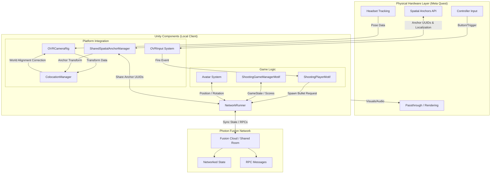
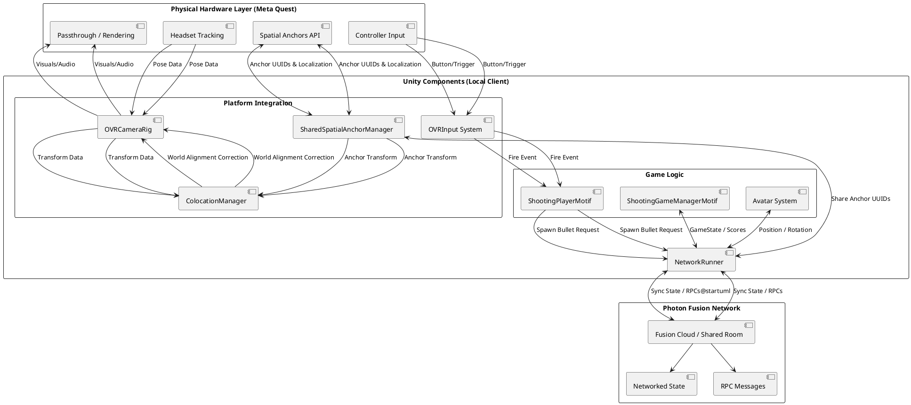

### System Architecture Diagram

### Data Flow Explanation

1.  **Physical Hardware Layer (Meta Quest)**
    *   **Input:** The headset provides 6DOF tracking data, and controllers provide button inputs (triggers, grips).
    *   **Spatial Anchors:** The device manages the local spatial anchors and their localization in the physical environment.

2.  **Unity Components (Local Client)**
    *   **Platform Integration:**
        *   `OVRCameraRig`: Receives raw tracking data.
        *   `SharedSpatialAnchorManager`: Interfaces with the hardware to create or locate anchors. It sends the Anchor UUIDs to other players via Photon Fusion.
        *   `ColocationManager`: The bridge between physical and virtual. It takes the localized anchor transform and aligns the `OVRCameraRig` so that the virtual coordinate system matches the physical world for all players.
    *   **Game Logic:**
        *   `ShootingPlayerMotif`: Reads `OVRInput` to detect firing. It requests the `NetworkRunner` to spawn networked bullet objects.
        *   `ShootingGameManagerMotif`: Manages the high-level game state (Score, Timer, Phase). It synchronizes this data automatically using Fusion's `[Networked]` properties.

3.  **Photon Fusion Network**
    *   **NetworkRunner:** The central networking component. It handles the connection to the Fusion Cloud.
    *   **Data Sync:**
        *   **State Authority:** The Host (or Master Client) maintains the "truth" for game state and anchors.
        *   **Replication:** Game state, avatar positions, and bullet spawns are replicated to all connected clients in real-time.

